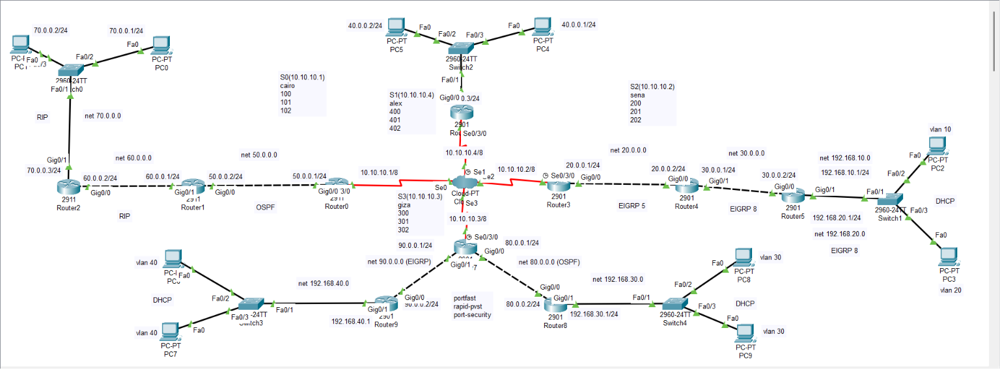
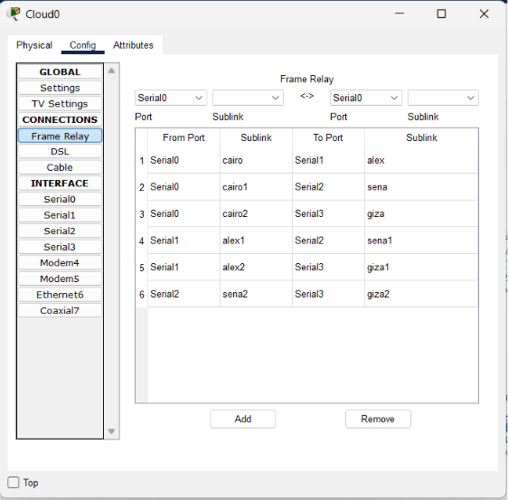
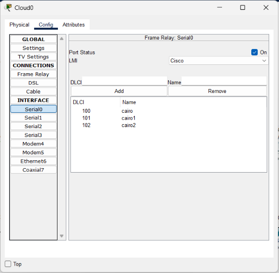
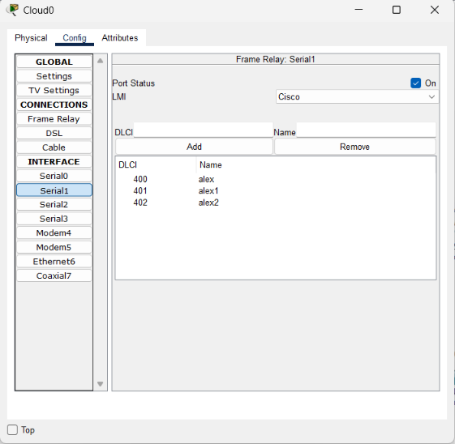
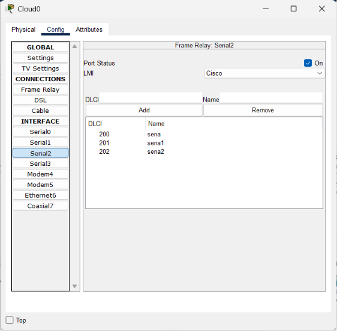
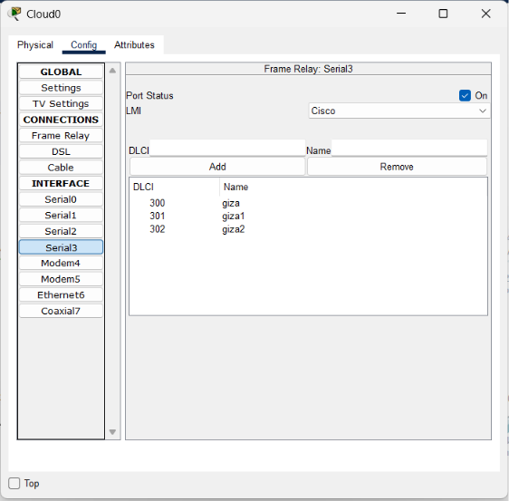

# Multi-Protocol Network Design (Cisco Packet Tracer)

A multi-domain network topology built in Cisco Packet Tracer, integrating three different routing protocols with mutual redistribution, Frame Relay WAN links, VLAN segmentation, and DHCP services.

## Network Overview

## Key Concepts Implemented

- **Multi-area routing with redistribution**: OSPF (area 0), RIP v2, and multiple EIGRP autonomous systems (AS 1, 5, 8) coexist across different routers, with **two-way route redistribution** configured wherever protocol domains meet (e.g., `redistribute rip subnets` on OSPF, `redistribute ospf 1 metric 5` on RIP)
- **Frame Relay WAN backbone**: Routers 0, 3, 6, and 7 connect over serial interfaces using Frame Relay encapsulation with multiple DLCIs, running OSPF over the Frame Relay cloud
- **VLAN segmentation with trunking**: Switches configure trunk ports (`switchport mode trunk`) and access ports assigned to specific VLANs (10, 20, 30, 40)
- **Router-on-a-stick / sub-interfaces**: Routers use dot1Q-tagged sub-interfaces (e.g., `gigabitEthernet 0/1.10`) to route between VLANs
- **DHCP services**: Each VLAN has a dedicated DHCP pool with a default gateway and DNS server
- **Switch port security**: Sticky MAC address learning with a restrict violation policy on access ports
- **Spanning Tree**: Rapid PVST mode with PortFast enabled on edge switches

## Topology Summary

- **WAN backbone (Frame Relay)** — R0, R3, R6, R7 → OSPF area 0
- **Branch 1** — R1 ↔ R2 → RIP v2 (redistributed into OSPF)
- **Branch 2** — R3 ↔ R4 ↔ R5 → EIGRP AS 5 ↔ EIGRP AS 8 (redistributed)
- **Branch 3** — R7 ↔ R8, R9 → OSPF ↔ EIGRP AS 1 (redistributed)
- **Access layer** — Switch 1, 3, 4 → VLANs 10/20/30/40 with DHCP

## Frame Relay Configuration Detail

The Frame Relay cloud (`Cloud0`) maps DLCIs between four serial interfaces, forming a full-mesh WAN backbone:

| Interface | DLCIs Configured |
|---|---|
| Serial0 | 100 (cairo), 101 (cairo1), 102 (cairo2) |
| Serial1 | 400 (alex), 401 (alex1), 402 (alex2) |
| Serial2 | 200 (sena), 201 (sena1), 202 (sena2) |
| Serial3 | 300 (giza), 301 (giza1), 302 (giza2) |

## Demo — End-to-End Connectivity Test

To validate that redistribution is working correctly across all three routing domains (OSPF, RIP v2, and the EIGRP autonomous systems), several ICMP tests were run between end devices located in completely different segments of the network — meaning each ping crosses at least one redistribution boundary.

| # | Source | Destination | Segments Crossed | Result |
|---|---|---|---|---|
| 1 | PC0 (RIP branch) | PC8 (OSPF branch, Router8/VLAN30) | RIP → OSPF | ✅ Successful |
| 2 | PC2 (EIGRP 8 branch) | PC6 (EIGRP 1 branch, Router9/VLAN40) | EIGRP 8 → EIGRP 5 → OSPF → EIGRP 1 | ✅ Successful |
| 3 | PC5 (OSPF backbone) | PC9 (OSPF branch, Router8/VLAN30) | OSPF (Frame Relay backbone) | ✅ Successful |
| 4 | PC4 (OSPF backbone) | PC7 (EIGRP 1 branch, Router9/VLAN40) | OSPF → EIGRP 1 | ✅ Successful |
| 5 | PC1 (RIP branch) | PC7 (EIGRP 1 branch, Router9/VLAN40) | RIP → OSPF → EIGRP 1 | ✅ Successful |
| 6 | PC0 (RIP branch) | PC9 (OSPF branch, Router8/VLAN30) | RIP → OSPF | ✅ Successful |
| 7 | PC5 (OSPF backbone) | PC3 (EIGRP 8 branch, VLAN20) | OSPF → EIGRP 5 → EIGRP 8 | ✅ Successful |
| 8 | PC2 (EIGRP 8 branch, VLAN10) | PC1 (RIP branch) | EIGRP 8 → EIGRP 5 → OSPF → RIP | ✅ Successful |

All PDUs completed successfully in Simulation mode, confirming that routes are being properly redistributed in both directions at every protocol boundary (RIP ↔ OSPF, OSPF ↔ EIGRP 1, EIGRP 5 ↔ EIGRP 8) and that VLAN/DHCP-assigned hosts can reach devices several hops away in a different routing domain.

📹 **Full video walkthrough of the test:**

https://github.com/user-attachments/assets/b0dffca3-8465-4a36-84a4-ec12112ad443

## Files

- `final_project.pkt` — the complete Packet Tracer topology (open with Cisco Packet Tracer)
- [`all commands.txt`](all%20commands.txt) — full CLI configuration for every router and switch in the topology
- `topology.png` — network diagram
- `frame-relay-config/` — Frame Relay DLCI mapping and per-interface configuration screenshots

## Tech Stack

- Cisco Packet Tracer
- Cisco IOS CLI (OSPF, RIP v2, EIGRP, Frame Relay, VLANs, DHCP, Spanning Tree, Port Security)

## How to Open

1. Install [Cisco Packet Tracer](https://www.netacad.com/courses/packet-tracer) (free with a Cisco Networking Academy account)
2. Open `final_project.pkt`
3. Use Simulation mode to trace packets across routing domains, or reference `all commands.txt` for the full CLI configuration of each device
